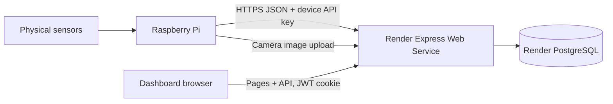

# Med House Access Monitor

An IoT dashboard for environmental readings, RFID/PIN access history, and camera snapshots. A Raspberry Pi sends data to a Node.js/Express API, PostgreSQL stores it, and the Express app serves the EJS dashboard. The dashboard and API are deployed together as one Render Web Service; Vercel is not required for this architecture.



## Run locally

1. Install Node.js, PostgreSQL, and the PostgreSQL command-line tools.
2. Follow [backend setup](backend/README.md) to create a database, import `backend/smart_access_schema_final.sql`, and install dependencies.
3. Copy `backend/.env.example` to `backend/.env`. Set the database connection values and a private random `JWT_SECRET`.
4. Add `ADMIN_USERNAME`, `ADMIN_PASSWORD`, `DEVICE_API_KEY`, `DEVICE_UID`, and `DEVICE_NAME` to `backend/.env`, then run `npm run setup` from `backend`. Setup creates the first dashboard admin and registers the Pi device; it does not overwrite existing credentials.
5. Run `npm start` from `backend`, then open `http://localhost:3000/login`.
6. Configure the Pi using [device setup and operation](device/README.md).

Run `npm test` from `backend` for PostgreSQL/HTTP integration checks. Use a separate test database.

## Deploy to Render

Render uses two resources: a PostgreSQL database and a Node Web Service. The Web Service serves both the API and the dashboard.

1. Create a Render PostgreSQL database. Keep its connection URLs private.
2. Import the schema into the new, empty database from PowerShell in the repository root. Use the external database URL from Render and replace the placeholder locally; do not paste credentials into source files or chat:

   ```powershell
   psql "<EXTERNAL_DATABASE_URL>" -v ON_ERROR_STOP=1 -f ".\backend\smart_access_schema_final.sql"
   ```

3. Create a Render **Web Service** from this GitHub repository, branch `main`:

   | Setting | Value |
   |---|---|
   | Runtime | Node |
   | Root Directory | `backend` |
   | Build Command | `npm ci` |
   | Start Command | `npm start` |
   | Region | Same region as the Render database |

   Choose an available plan. Render supplies `PORT`; do not set it yourself. Enable auto-deploy from `main` if desired.

4. Add these environment variables to the Web Service:

   | Name | Value |
   |---|---|
   | `DATABASE_URL` | Render PostgreSQL **internal** database URL |
   | `JWT_SECRET` | A new, private random secret |
   | `NODE_ENV` | `production` |
   | `HIGH_TEMPERATURE_THRESHOLD` | Optional; defaults to `30` |
   | `HIGH_HUMIDITY_THRESHOLD` | Optional; defaults to `70` |

   Set `DB_SSL=true` only if required by the database connection. Do not put the plain device API key in the Web Service environment for normal operation; the database stores its hash.

5. Run the one-time setup against the hosted database. On your computer, set `backend/.env` to use the **external** Render database URL and choose `ADMIN_USERNAME`, `ADMIN_PASSWORD`, `DEVICE_API_KEY`, `DEVICE_UID=main-entrance-pi`, and `DEVICE_NAME`. From the `backend` folder, run:

   ```powershell
   npm run setup
   ```

   Use a fresh random device key of at least 32 characters. Setup hashes the admin password and device key before storing them. Existing usernames and device UIDs are not overwritten; setup is not a password-reset command. Keep `.env` files out of Git.

6. Render provides a public HTTPS URL for the Web Service. The dashboard login is `<SERVICE_URL>/login`. Use this base URL for the Pi's `SERVER_URL`; never use a PostgreSQL URL on the Pi.

The dashboard and API share the same origin, so there is no separate Vercel frontend or cross-origin API configuration in this project. A separate Vercel frontend would require an architecture change.

### Admin and device credentials

The dashboard and Pi enrollment prompt use the admin account created in the hosted database by `npm run setup`. A local-only admin does not automatically exist in Render's database. If the username already exists in Render, setup will not change its password.

The device API key is separate from the admin password and database password. The plain key goes in the Pi's private `.env`; the database stores its SHA-256 hash. To rotate it, set the new `DEVICE_API_KEY` and matching `DEVICE_UID` in `backend/.env`, run `npm run rotate-device-key` from `backend`, then update the Pi's `.env` with the exact same key.

## Raspberry Pi connection

In `device/.env` on the Pi, set:

```dotenv
SERVER_URL=https://<your-render-service>.onrender.com
DEVICE_API_KEY=<the-registered-plain-device-key>
DEVICE_UID=main-entrance-pi
```

The Pi sends telemetry every five seconds and sends camera images to the same HTTPS service. The device key authenticates Pi write requests. After setup, start the firmware with `python main.py` from the Pi firmware folder. See [device/README.md](device/README.md) for installation, enrollment, file transfer, and sensor fault behavior.

For a direct file transfer, the PC and Pi must be able to reach each other over the same LAN (or a configured VPN). From PowerShell at the repository root:

```powershell
scp .\device\main.py .\device\hardware.py pi@<PI_LAN_IP>:~/Iot_firmware/
```

Copy `device/.env` separately and privately; never add it to Git. Use USB when direct network transfer is unavailable.

## Simulated room

The simulator is a local demo process, not part of the Render Web Service. It writes directly to the PostgreSQL database configured in `backend/.env` and creates/updates `simulated-room-pi` (Room 2). For it to feed the deployed dashboard, set the local `backend/.env` `DATABASE_URL` to the Render **external** database URL.

From the repository root, run one sample:

```powershell
npm --prefix backend run simulate -- --once
```

Run continuously, keeping the terminal open:

```powershell
npm --prefix backend run simulate
```

Open `/rooms`, then Room 2, or use `/dashboard?device_uid=simulated-room-pi` after signing in. The simulator adds readings every five seconds, cycles environmental alerts, and occasionally adds an access log; it does not create users or snapshots and does not replace real Pi data. Stop it with `Ctrl+C`. A Render Background Worker is a separate, plan-dependent resource; you do not need one for a local demo.

## Sensor resilience and dashboard behavior

The dashboard polls every five seconds. A device becomes offline after two minutes without telemetry; offline status means the Pi stopped communicating, not necessarily that every sensor has failed.

- If the DHT22 is disconnected or returns invalid/stale data, the Pi keeps running and sends `temperature` and `humidity` as `null`. The dashboard shows **DHT22 unavailable** and changes back when valid readings resume.
- If the MQ-3 GPIO read raises an error, the Pi logs `Gas sensor read failed`, sends `gas_present: null`, and continues its telemetry loop. The dashboard shows the gas sensor as unavailable. A physically disconnected digital output can float and look like a valid HIGH or LOW, so reliable wire-break detection needs supervised wiring or a separate hardware fault signal.
- Unknown sensor readings do not clear existing alerts. An unknown gas value by itself does not turn on the fan.
- The Pi queues telemetry, access events, and snapshots during server outages. Access checks fail closed: if the server cannot verify a card/PIN pair, entry is denied.

Camera images are written to `backend/uploads` on the Web Service's local filesystem. Use persistent storage or object storage if images must survive service replacement or redeployment.

## Project structure

- `backend/`: Express routes, authentication, PostgreSQL connection, schema, setup, simulator, and tests.
- `device/`: Raspberry Pi firmware, hardware drivers, and device setup guide.
- `frontend/`: EJS views, CSS, JavaScript, and dashboard assets served by Express.
- `docs/openapi.json`: API specification.
- [Assignment review](docs/assignment-review.md): coverage and remaining submission evidence.

## Team roles and attribution

Andrea: device firmware/hardware; Uchindami: backend/database; Annie: frontend/testing.

External libraries include Express, EJS, jQuery, Chart.js, pg, bcrypt, jsonwebtoken, multer, and dotenv (versions in `backend/package-lock.json`). Codex assisted with implementation review, simplification, documentation, and tests. Team members must review and understand the code they present. Confirm the source and permitted use of existing image assets before submission.