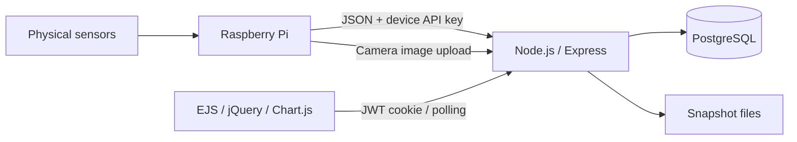

# Smart Access Monitor

An IoT dashboard for environmental readings, RFID/PIN access history, and camera snapshots. A Raspberry Pi sends data to an Express API, PostgreSQL stores it, and EJS pages use jQuery and Chart.js to display current values and history.

## Run locally

1. Install Node.js and PostgreSQL.
2. Follow [backend setup](backend/README.md) to create a fresh database, import the schema, and install dependencies.
3. Copy `backend/.env.example` to `backend/.env` and fill in the database credentials and a private random `JWT_SECRET`.
4. Supply `ADMIN_USERNAME`, `ADMIN_PASSWORD`, and `DEVICE_API_KEY` through your shell and run `npm run setup` from `backend`.
5. Run `npm start` from `backend`, then open http://localhost:3000/login.
6. Configure the Pi firmware in `device/` to send the payload documented in [the API specification](docs/openapi.json).

Run `npm test` from `backend` for PostgreSQL/HTTP integration checks. Tests create uniquely named records and remove them afterward; a separate test database is recommended.

## Deploy online

The backend is an Express web service with PostgreSQL, so deploy it as a persistent Node web service (for example, a Render Web Service) rather than as a static site. Create a hosted PostgreSQL database and a web service from this repository with `backend` as the root directory, `npm ci` as the build command, and `npm start` as the start command.

Set the service environment variables `DATABASE_URL` (the provider's private/internal database URL), `JWT_SECRET` (a new strong random value), `NODE_ENV=production`, and any desired alert thresholds. Set `DB_SSL=true` only if the database provider requires TLS for that connection. Import `backend/smart_access_schema_final.sql` into the new, empty hosted database, then run `npm run setup` once against it with `ADMIN_USERNAME`, `ADMIN_PASSWORD`, `DEVICE_API_KEY`, `DEVICE_UID`, and `DEVICE_NAME` set. The setup script does not replace existing admin/device credentials, so use a fresh database or provision credentials deliberately.

After deployment, set the Pi's `SERVER_URL` to the service's public HTTPS URL. Keep its `DEVICE_UID` and plain `DEVICE_API_KEY` consistent with the device registered by setup; do not put database credentials on the Pi.

Snapshot files are currently written to the service's local `backend/uploads` directory. Configure persistent storage there or move images to object storage before relying on snapshots surviving service replacement/redeployment.

## Project structure

- `backend/`: Express routes, authentication, PostgreSQL connection, SQL schema, setup, and integration test.
- `frontend/`: EJS templates, CSS, and jQuery scripts.
- `docs/openapi.json`: importable API documentation with examples.
- [Assignment review](docs/assignment-review.md): coverage, simplification decisions.

The dashboard refreshes every five seconds. It shows up to 1,000 recent readings filtered to the selected time range. A device is offline after two minutes without telemetry; displayed values are then explicitly labelled as last known readings. Missing sensor values use `null` and appear as unavailable.

## Team roles and attribution

Andrea: device firmware/hardware,Uchindami: backend/database, Annie: frontend/testing.

External libraries: Express, EJS, jQuery, Chart.js, pg, bcrypt, jsonwebtoken, multer, and dotenv (versions in `backend/package-lock.json`). Codex assisted with the implementation review, simplification, documentation, and tests. Team members must review and understand the code they present. Confirm the source and permitted use of the existing image assets before submission.
